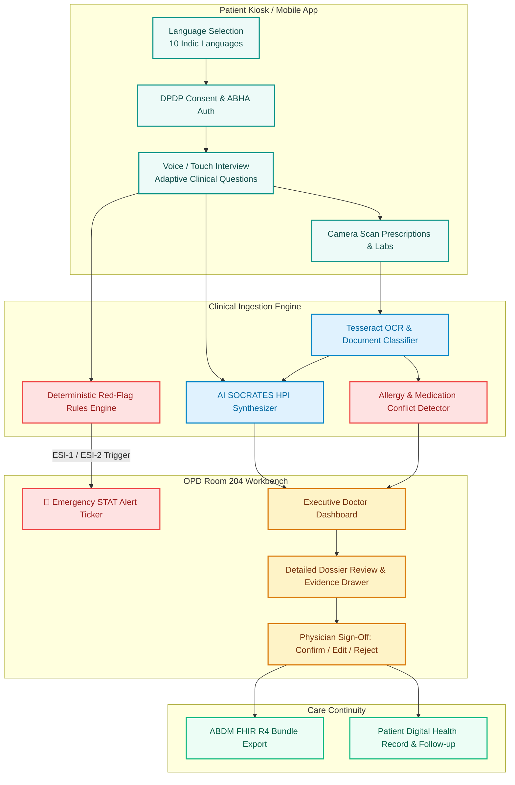

# ArogyaDarpan (आरोग्यदर्पण) 🩺

<p align="center">
  
</p>

<h3 align="center">AI-Powered Pre-Consultation Clinical Intake & Care-Continuity Platform</h3>

<p align="center">
  <em>Your health story, structured and clinically synthesized before you step into the doctor's room.</em>
</p>

<p align="center">
  
  
  
  
  
  
</p>

---

> ### 💡 Core Clinical Philosophy
> **"AI prepares. AI explains. The doctor decides."**  
> *ArogyaDarpan never replaces clinical judgment. It eliminates 80% of repetitive documentation time, flags critical emergencies instantly, and provides full audit traceability back to source documents.*

---

## 📑 Table of Contents
- [🌟 The OPD Challenge & Solution](#-the-opd-challenge--solution)
- [✨ Key Architectural Features](#-key-architectural-features)
- [🩺 Doctor Clinical Command Center](#-doctor-clinical-command-center)
- [🧬 End-to-End System Workflow](#-end-to-end-system-workflow)
- [🛠️ Technology Stack](#️-technology-stack)
- [📂 Repository Structure](#-repository-structure)
- [📱 Running the Android App](#-running-the-android-app)
- [⚡ Web Quick Start](#-web-quick-start)
- [🎯 Golden Path Demo (for SIH Judges)](#-golden-path-demo-for-sih-judges)
- [🛡️ Clinical Safety & Data Ethics](#️-clinical-safety--data-ethics)
- [🎨 Doctory App Design Reference](#-doctory-app-design-reference)

---

## 🌟 The OPD Challenge & Solution

In typical Indian outpatient departments (OPDs), doctors examine **60–100+ patients in a single 4-hour shift** (less than 3 minutes per consultation):
- **50% of consultation time** is squandered on basic intake questions, deciphering old handwritten prescriptions, and manual note-taking.
- **Critical red flags** (e.g. radiating chest pain, unstable vitals, past drug allergies) can be inadvertently buried under thick folders.
- **Language barriers** impede accurate symptom description for non-English/non-Hindi speaking patients.

### How ArogyaDarpan Solves This:
1. **At the Hospital Kiosk or on the Patient's Mobile App**: The patient checks in using their ABHA ID or phone number, grants DPDP-compliant consent, speaks in their native language (10 Indic languages supported), and takes photos of old prescriptions.
2. **Intelligent Ingestion Pipeline**: On-device OCR digitizes lab values and medications; deterministic rules categorize urgency using the **Emergency Severity Index (ESI-1 to 5)**; an LLM engine summarizes the History of Present Illness (HPI) structured under the clinical **SOCRATES** framework.
3. **At the Doctor's Desk**: When the patient enters OPD Room 204, the physician has an executive **Clinical Command Center** with verified vitals, differential diagnoses (ICD-10 ranked), allergy conflict warnings, and a 1-click **Confirm / Edit / Sign** workflow that publishes directly to ABDM FHIR R4.

---

## ✨ Key Architectural Features

### 🎙️ 1. Multilingual Voice + Touch Intake (10 Indian Languages)
- Real-time Speech-to-Text (STT) and Text-to-Speech (TTS) engine.
- Supports **Hindi, English, Bengali, Telugu, Marathi, Tamil, Gujarati, Urdu, Kannada, and Punjabi**.
- Ambient breathing visualizers, live transcript correction, and fallback touch chips for noisy waiting rooms.

### ⚡ 2. Deterministic Red-Flag Safety Engine
- **Zero LLM hallucination risk for life-threatening emergencies**: Clinical red-flag rules are strictly deterministic.
- Flags chest pain radiating to left arm, acute dyspnea, stroke signs, pediatric high fevers, or severe vitals deviations.
- Instantly elevates triage priority to **ESI Level 1 (Resuscitation)** or **ESI Level 2 (Emergent)** and notifies the physician via real-time STAT alert tickers.

### 📄 3. Medical Document Scanning & OCR Extraction
- Digitize paper prescriptions, laboratory reports, discharge summaries, and vaccine cards using native device camera (`@capacitor/camera`) or file upload.
- Automated extraction with confidence scoring (e.g., *Metformin 500mg BID — 96% Confidence*).
- Interactive **OCR Inspector Modal** allows visual inspection of digitized JSON schemas alongside original document scans.

### 🔍 4. Conflict Detection & Audit Traceability
- Automatically cross-checks patient verbal statements against historical hospital records (e.g., patient states *"No allergies"*, but a 2024 discharge summary notes *"Severe Penicillin Urticaria"*).
- **Evidence Drawer**: Every extracted medication, symptom, or past illness links back to its exact audio transcript snippet or scanned document section with timestamp.

### ⏳ 5. Longitudinal Unified Medical Timeline
- Interactive chronological visualization unifying active chief complaints, chronic disease diagnoses (e.g., Type 2 Diabetes, Hypertension), past surgical history, and multi-year lab trends into a single interactive journey.

### 🌿 6. AYUSH & Dashavidha Pariksha Integration
- Built-in clinical module for holistic Indian Medicine (Ayurveda/AYUSH) supporting **Dashavidha Pariksha** (Prakriti, Vikriti, Sara, Samhanana, Pramana, Satmya, Satva, Ahara Shakti, Vyayama Shakti, Vaya).

### 🔒 7. ABDM & DPDP Act 2023 Compliance
- Built-in ABHA (Ayushman Bharat Health Account) verification badge.
- Explicit informed digital consent signed by the patient prior to data capture.
- One-click export to **FHIR R4 DiagnosticReport & Encounter Bundles** compatible with national health registries.

---

## 🩺 Doctor Clinical Command Center

The Doctor Dashboard (`/doctor`) has been engineered as an executive-grade clinical workstation:

| Feature | Description |
| :--- | :--- |
| **Real-Time Clinical Header** | Live digital clock (IST with seconds ticker), **ON DUTY** beacon, OPD Room 204 badge, and Kiosk Mesh live telemetry sync. |
| **STAT Emergency Alert Ticker** | Highlighted emergency banner showcasing ESI-2 emergent cases with 1-click **Examine STAT Dossier** routing. |
| **4-KPI Telemetry HUD** | Live counts for Total Registered, Priority Red-Flags, Ready for Review, and Completed Today. |
| **Intelligent Search & Filter** | Search by patient name, queue token (`#A-14`), ABHA ID, phone, or symptom with multi-filter pills. |
| **Multi-Criteria Quick Sorter** | Sort by **Triage Severity** (High → Low), **Queue Token / Arrival**, **Longest Wait Time**, or **Patient Name**. |
| **Dual View Modes** | Toggle between **Expanded Clinical Cards** (rich telemetry) and **Compact High-Throughput Table View** (speed triage). |
| **Live Vitals Ribbon** | At-a-glance telemetry displaying `BP: 138/88 mmHg`, `HR: 88 bpm`, `SpO2: 97%`, `Temp: 98.6°F`, and `Pain: 7/10`. |
| **Multilingual Hinting** | Displays patient chief complaint alongside Hindi translated preview (e.g., `HI सीने में भारीपन व तेज़ दर्द`). |

---

## 🧬 End-to-End System Workflow



---

## 🛠️ Technology Stack

```text
┌─────────────────────────────────────────────────────────────────────────┐
│                           AROGYADARPAN STACK                            │
├──────────────────┬──────────────────────────────────────────────────────┤
│ Core Framework   │ React 19.1.0 • Vite 8.2.2 • React Router v7          │
│ Native Engine    │ Capacitor 7.1.2 (Android Studio • Gradle 8.x)        │
│ Styling & Tokens │ Tailwind CSS v4 • Custom Clinical Glass Design System│
│ Motion & Icons   │ Framer Motion 13 • Lucide React • Material Symbols   │
│ On-Device Vision │ Tesseract.js 7.0 • Native Capacitor Camera Plugin    │
│ Voice Pipeline   │ Web Speech API • Capacitor Speech Recognition        │
│ Backend Service  │ Node.js • Express.js • Multer • Mongoose             │
│ Standards        │ ABDM Milestones 1-3 • FHIR R4 JSON • ICD-10 Coding   │
└──────────────────┴──────────────────────────────────────────────────────┘
```

---

## 📂 Repository Structure

```text
arogyadarpan-android/
├── android/                         # Complete Native Android Studio Project
│   ├── app/                         # Android App module (AndroidManifest, build.gradle)
│   └── build.gradle                 # Project Gradle configuration
├── capacitor.config.json            # Capacitor Android native configuration
├── doctory-app-design/              # High-fidelity reference design prototypes
│   ├── 01_onboarding.html           # Native onboarding experience
│   ├── 02_home_dashboard.html       # Patient home health portal
│   ├── 03_select_doctor.html        # Department & physician directory
│   ├── 04_doctor_profile.html       # Physician credentials & reviews
│   ├── 05_appointment_booking.html  # Slot scheduling & token generator
│   ├── 06_digital_ticket.html       # OPD digital queue pass
│   └── index.html                   # Interactive design mockup index
├── public/                          # Static assets, branding & audio assets
├── src/
│   ├── components/                  # Clinical UI components
│   │   ├── StitchAppHeader.jsx      # Adaptive mobile/tablet app bar
│   │   ├── Timeline.jsx             # Longitudinal chronological visualizer
│   │   ├── EvidenceDrawer.jsx       # Source audit trail & verification modal
│   │   ├── LLMSummaryGenerator.jsx  # Interactive AI clinical summarizer
│   │   ├── DifferentialDiagnosis.jsx# ICD-10 differential diagnosis widget
│   │   ├── DocumentInspectorModal.jsx # OCR JSON viewer & document zoom
│   │   └── Card.jsx, Button.jsx...  # Design system primitives
│   ├── context/
│   │   └── LanguageContext.jsx      # Multilingual translation provider
│   ├── data/
│   │   ├── demoPatients.js          # Golden test patients (Rahul, Sunita, Ramesh, Priya)
│   │   ├── questionBank.js          # Clinical adaptive intake questionnaire
│   │   └── translations.js          # 10 Indian language dictionary
│   ├── pages/
│   │   ├── doctor/                  # Doctor Command Center
│   │   │   ├── DoctorLogin.jsx      # Doctor credential & biometric auth
│   │   │   ├── DoctorDashboard.jsx  # Live OPD Triage Command Center
│   │   │   └── PatientDetail.jsx    # 8-Part clinical dossier & ABDM export
│   │   └── patient/                 # Patient Intake Journey
│   │       ├── SplashScreen.jsx     # Animated branding entrance
│   │       ├── LanguageSelection.jsx# 10 Indic language picker
│   │       ├── ConsentScreen.jsx    # DPDP Act 2023 consent reader
│   │       ├── PatientDashboard.jsx # Patient Wellness Hub
│   │       ├── InterviewScreen.jsx  # Adaptive voice intake
│   │       ├── DocumentUpload.jsx   # Camera & PDF OCR ingestor
│   │       └── ConfirmationScreen.jsx # Pre-consultation summary check
│   ├── services/
│   │   ├── sessionStore.js          # Reactive clinical session state & normalization
│   │   ├── doctorAuthService.js     # Physician session management & PIN auth
│   │   ├── ocrEngine.js             # Client-side & backend OCR processor
│   │   ├── differentialEngine.js    # ICD-10 clinical correlation matrix
│   │   └── abdmService.js           # FHIR R4 Bundle generator
│   ├── index.css                    # Design tokens & horizontal overflow lockdown
│   └── main.jsx                     # Application entry point
├── backend/                         # Standalone Node/Express REST API (Optional)
├── package.json                     # Node dependencies & build scripts
└── vite.config.js                   # Vite bundler configuration
```

---

## 📱 Running the Android App

### Option A: Open in Android Studio (Recommended)
1. Install [Android Studio](https://developer.android.com/studio).
2. Open Android Studio and choose **Open**, then select:
   ```text
   arogyadarpan-android/android
   ```
3. Allow Gradle to sync dependencies automatically.
4. Connect an Android device with **USB Debugging** enabled, or start an Android Virtual Device (AVD).
5. Click **Run ▶** (or press `Shift + F10`).

Alternatively, launch Android Studio via terminal:
```bash
npm run cap:open
```

### Option B: Build APK Directly via Terminal
```bash
# Build web bundle and sync native assets
npm run build:android

# Compile debug APK with Gradle
cd android
./gradlew assembleDebug
```
The output APK is generated at:
```text
android/app/build/outputs/apk/debug/app-debug.apk
```

---

## ⚡ Web Quick Start

ArogyaDarpan runs fully in browser mode with simulated sensors, local storage persistence, and mock OCR out of the box:

```bash
# 1. Clone the repository
git clone https://github.com/sarvesh2010-sketch/arogyadarpan-android.git
cd arogyadarpan-android

# 2. Install dependencies
npm install

# 3. Start local development server
npm run dev
```
Open **[http://localhost:5173](http://localhost:5173)** in Chrome or Edge.

---

## 🎯 Golden Path Demo (for SIH Judges)

To evaluate the complete clinical intake and physician review workflow in under **3 minutes**:

1. **Launch**: Open [http://localhost:5173](http://localhost:5173).
2. **Patient Intake**:
   - Tap **"Start Patient Intake"** on the landing page.
   - Select **Hindi** or **English**.
   - Read and accept the **DPDP Act 2023 Consent** (test the TTS *Read aloud* button).
   - Tap **"Continue as Demo Patient (Rahul Sharma)"**.
   - In the **Interview**: Tap the microphone or select **Chest Pain** → Onset **2-3 days** → Severity **7/10** → Radiation **Left Arm** → Breathlessness **Yes**.
   - Notice the **🚨 Priority STAT Trigger** automatically fire!
   - Upload sample prescriptions in **Document Scan** to see OCR digitization.
3. **Doctor Command Center**:
   - Click **"Doctor Portal"** in the navigation or visit `/doctor/login`.
   - Log in with ID `DMC-2018-4921`, PIN `1234` (or tap **"1-Tap Demo Doctor Bypass"**).
   - In the **Doctor Dashboard**:
     - Inspect the live digital clock and **ON DUTY** telemetry beacon.
     - See the **STAT Emergency Alert Ticker** at the top highlighting Rahul Sharma.
     - Toggle between **Expanded Cards** and **Compact Table View**.
     - Test the search bar and priority filter chips.
   - Click **"Examine Dossier & AI Summary"**:
     - Review the 8-Part structured clinical intake.
     - Inspect the **Allergy Conflict Alert** (verbal *"No allergies"* vs 2024 record *"Penicillin Allergy"*).
     - Test 1-click **Confirm / Edit / Reject** verification.
     - Click **"FHIR / ABDM Bundle"** to view and download standardized healthcare JSON.
     - Click **"Sign & Complete Consultation"**.

---

## 🛡️ Clinical Safety & Data Ethics

1. **Deterministic Over Probabilistic**: Clinical emergency detection never relies on probabilistic LLM responses. Emergency Severity Index (ESI) levels are evaluated using strict medical logic rules.
2. **Zero Negative Presumption**: Information that was not explicitly captured is designated `"Unknown — pending verification"`, never converted into a negative finding (e.g. `"No family history"`).
3. **Doctor-in-the-Loop Authority**: The AI only drafts summaries and highlights anomalies; only a licensed medical practitioner can sign orders, accept ICD-10 diagnoses, or discharge patients.
4. **Source Audit Trail**: Clinicians can click any bullet in the generated note to reveal the exact raw voice recording transcript or scanned document image where the fact originated.

---

## 🎨 Doctory App Design Reference

The [`doctory-app-design/`](./doctory-app-design/) directory provides modern, stand-alone HTML5 mockups representing future mobile patient application features:
- `01_onboarding.html`: Visual walkthrough of patient onboarding.
- `02_home_dashboard.html`: Mobile patient health dashboard with appointment cards.
- `03_select_doctor.html`: Hospital department and specialist browser.
- `04_doctor_profile.html`: Doctor qualifications, OPD hours, and patient reviews.
- `05_appointment_booking.html`: Date picker and OPD time slot selector.
- `06_digital_ticket.html`: Digital hospital token with QR code for kiosk check-in.

---

## 📄 License & Team

Built for **Smart India Hackathon (SIH) 2026** by the student engineering team.  
Licensed under the **MIT License**.
