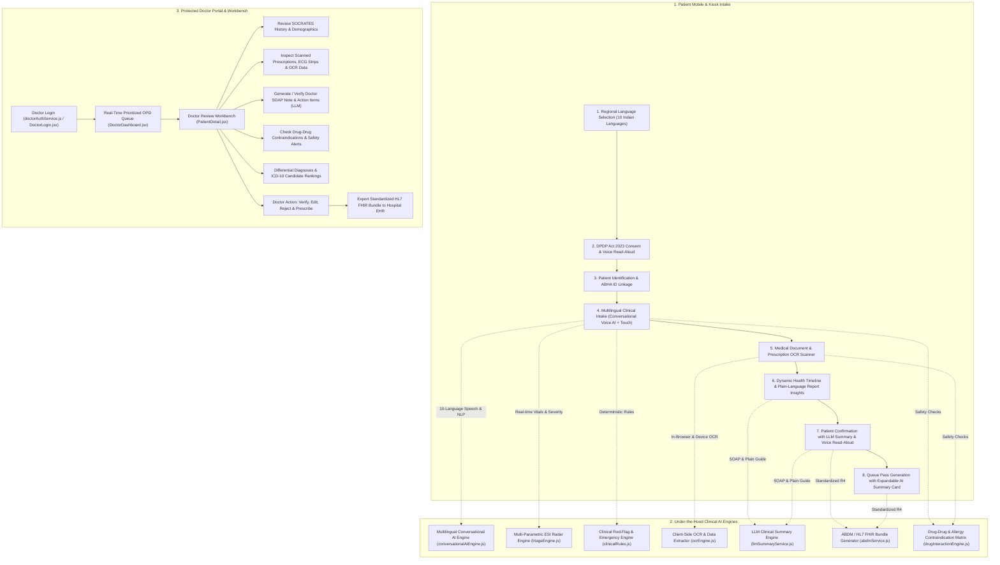

# 🏥 ArogyaDarpan Android — Complete Platform Architecture & Workflow

> **Core Philosophy:** *"AI Prepares. AI Explains. The Doctor Decides."*
> 
> ArogyaDarpan Android is an **AI-Assisted Smart OPD Clinical Intake, Multilingual Triage & Doctor Workbench Mobile/Kiosk Application** developed for the Smart India Hackathon (SIH 2026). It bridges the clinical communication divide across India's regional languages through **voice-driven multilingual symptom reporting**, **on-device/cloud LLM clinical summary generation**, **prescription & lab report OCR**, and a **protected Doctor Review Portal**.

---

## 🗺️ System Architecture & Workflow Flowchart



---

## 📁 Codebase Structure & File Tree (`arogyadarpan-android`)

```
arogyadarpan-android/
├── index.html                      # HTML5 container with Inter & Outfit typography
├── package.json                    # Capacitor 7, React 19, Tailwind v4, Lucide, Framer Motion, Tesseract.js
├── vite.config.js                  # Vite bundler configuration
├── capacitor.config.json           # Native Capacitor mobile bridge configuration
├── android/                        # Native Android Studio project (Gradle, Manifest, Plugins)
│
├── src/                            # FRONTEND APPLICATION SOURCE
│   ├── main.jsx                    # React 19 root renderer
│   ├── App.jsx                     # Router, animations (AnimatePresence), Doctor & Patient route definitions
│   ├── index.css                   # Tailwind v4 theme, HSL medical color palette, glassmorphism tokens
│   │
│   ├── pages/                      # APPLICATION ROUTE PAGES
│   │   ├── LandingPage.jsx         # Kiosk launcher, Doctor Portal button, and feature showcase
│   │   ├── DemoPage.jsx            # Interactive testing suite (Golden Demo, Patient flow, Doctor Portal)
│   │   │
│   │   ├── patient/                # PATIENT INTAKE & TRIAGE JOURNEY
│   │   │   ├── SplashScreen.jsx         # App intro splash screen with native status bar config
│   │   │   ├── LanguageSelection.jsx    # Step 1: 10 Indian language switcher
│   │   │   ├── ConsentScreen.jsx        # Step 2: DPDP Act 2023 & ABDM consent with audio read-aloud
│   │   │   ├── PatientIdentification.jsx# Step 3: Demographics, phone verification & ABHA ID linkage
│   │   │   ├── InterviewScreen.jsx      # Step 4: Voice/touch intake, SOCRATES questions & Conversational AI
│   │   │   ├── DocumentUpload.jsx       # Step 5: Prescription & lab report camera/file upload with OCR
│   │   │   ├── DocumentReview.jsx       # Step 6: Dynamic medical timeline & plain-language AI report insights
│   │   │   ├── ConfirmationScreen.jsx   # Step 7: Pre-intake checklist + Embedded LLM Clinical Summary
│   │   │   ├── CompletionScreen.jsx     # Step 8: OPD Queue Pass with expandable AI Summary card
│   │   │   └── PatientDashboard.jsx     # Patient health dossier with Voice AI quick-launch tile
│   │   │
│   │   └── doctor/                 # PROTECTED DOCTOR PORTAL & WORKBENCH
│   │       ├── DoctorLogin.jsx          # Secure Doctor Login with 1-tap quick demo bypass (Dr. Sharma)
│   │       ├── DoctorDashboard.jsx      # Triage-sorted OPD queue, ESI-2 priority filter, and search
│   │       └── PatientDetail.jsx        # Clinical review workbench: SOCRATES, OCR docs, LLM SOAP notes & orders
│   │
│   ├── components/                 # REUSABLE UI & CLINICAL COMPONENTS
│   │   ├── ConversationalVoiceModal.jsx # 10-language voice dialogue modal with STT/TTS & entity extractor
│   │   ├── LLMSummaryGenerator.jsx      # Clinical SOAP note, patient guide, voice audio playback & model switcher
│   │   ├── LLMConfigModal.jsx           # Cloud/Local AI configuration (Gemini, Groq, OpenAI, Ollama)
│   │   ├── CameraCaptureModal.jsx       # Live camera photo capture for prescriptions & lab records
│   │   ├── LanguageSelector.jsx         # Regional language dropdown / compact selector
│   │   ├── ConfidenceBadge.jsx          # Visual confidence indicator for AI-extracted entities (e.g. 96%)
│   │   ├── ClinicalSignalCard.jsx       # Red-flag emergency alert card with clinical citations
│   │   ├── SymptomRadarCard.jsx         # Real-time multi-symptom triage radar with ESI severity level
│   │   ├── CompletenessTracker.jsx      # Progress tracker covering all required clinical history fields
│   │   ├── Timeline.jsx                 # Interactive vertical health chronology
│   │   ├── VerificationButtons.jsx      # Doctor "Confirm / Edit / Reject" interactive controls
│   │   ├── DrugSafetyBanner.jsx         # Real-time drug-drug & allergy contraindication warnings
│   │   ├── DifferentialDiagnosisWidget.jsx # AI differential diagnosis ranking with ICD-10 codes
│   │   ├── EvidenceDrawer.jsx           # Slide-over panel displaying raw OCR text and voice transcripts
│   │   ├── DocumentInspectorModal.jsx   # Full-screen modal for inspecting uploaded medical records
│   │   └── KioskView.jsx                # Fullscreen MediKiosk physical station mode wrapper
│   │
│   ├── hooks/                      # CUSTOM REACT HOOKS
│   │   ├── useInterview.js         # Manages adaptive questions, completeness, and triage state
│   │   └── useVoiceInput.js        # Multilingual Speech-to-Text wrapper with fallback handling
│   │
│   ├── services/                   # CLINICAL INTELLIGENCE & AI SERVICES
│   │   ├── conversationalAiEngine.js# Multilingual symptom recognition and dialogue engine (10 languages)
│   │   ├── llmSummaryService.js     # Clinical SOAP note & patient explanation generator (Cloud & Offline)
│   │   ├── doctorAuthService.js     # Protected doctor authentication session and credentials
│   │   ├── clinicalRules.js         # Deterministic emergency red-flag rules (no LLM hallucinations)
│   │   ├── triageEngine.js          # Multi-parametric ESI Level 1-5 classification & risk scoring
│   │   ├── medicalParserService.js  # Clinical NLP entity extractor for symptoms, drugs, & lab tests
│   │   ├── ocrEngine.js             # Tesseract.js in-browser OCR scanner with date and entity extraction
│   │   ├── drugInteractionEngine.js # Drug-drug interaction & allergy contraindication matrix
│   │   ├── differentialEngine.js    # AI differential diagnosis generator with ICD-10 mapping
│   │   ├── reportInsightEngine.js   # Plain-language report explanation & curative guidance
│   │   ├── abdmService.js           # Standardized HL7 FHIR R4 document bundle generator
│   │   ├── sessionStore.js          # Reactive store, doctor patient queue, and local persistence
│   │   ├── audioService.js          # Web Speech Synthesis text-to-speech audio helper
│   │   └── nativeCamera.js          # Capacitor Camera hardware bridge
│   │
│   └── data/                       # CLINICAL ONTOLOGIES & DEMO DATA
│       ├── translations.js          # 10 Indian languages UI localization strings
│       ├── questionBank.js          # SOCRATES pain trees, ROS questions, and clinical options
│       └── demoPatients.js          # Pre-loaded clinical profiles (Rahul Sharma, Sunita Devi, etc.)
```

---

## 📋 Comprehensive Feature Walkthrough

---

### Feature 1: Multilingual Conversational AI (Voice & Text across 10 Languages)

Patients can express their symptoms naturally using voice or text in any of India's major regional languages.

- **Supported Languages**:
  1. English (`en`)
  2. हिन्दी - Hindi (`hi-IN`)
  3. বাংলা - Bengali (`bn-IN`)
  4. தமிழ் - Tamil (`ta-IN`)
  5. తెలుగు - Telugu (`te-IN`)
  6. मराठी - Marathi (`mr-IN`)
  7. ગુજરાતી - Gujarati (`gu-IN`)
  8. ಕನ್ನಡ - Kannada (`kn-IN`)
  9. ਪੰਜਾਬੀ - Punjabi (`pa-IN`)
  10. മലയാളം - Malayalam (`ml-IN`)

- **Workflow**:
  1. Patient taps **"🎙️ बोलकर अपने लक्षण बताएं (Conversational Voice AI)"** on the interview screen or patient dashboard.
  2. Patient speaks naturally (e.g., *"सीने में बहुत तेज दर्द है और कल से चक्कर आ रहे हैं"* or *"எனக்கு 2 நாட்களாக கடுமையான காய்ச்சல் உள்ளது"*).
  3. The engine parses the voice transcript into structured clinical entities:
     - **Primary Complaint**: Identified and normalized into standard clinical categories (Chest Pain, Fever, Cough, etc.).
     - **Onset & Duration**: Captured (today, 1 day, 2-3 days, 1 week).
     - **Severity**: Extracted (1 to 10 scale).
     - **Associated Symptoms**: Flagged (dizziness, breathlessness, nausea, etc.).
  4. The AI speaks back a reassuring confirmation in the patient's language via Text-to-Speech.
  5. The patient taps **"Apply to Intake"** to populate the clinical record and advance the workflow.

---

### Feature 2: LLM Clinical Summary Generator

Situated on the final patient review screens and inside the Doctor Workbench, the LLM Summary Generator creates high-utility clinical notes and plain-language guides.

- **AI Providers Supported**:
  - **Google Gemini** (Gemini 2.5 Flash / Flash-Lite / Pro)
  - **Groq Cloud** (Llama 3.3 70B Versatile, Llama 3.1 8B Instant)
  - **OpenAI** (GPT-4o mini, GPT-4o)
  - **Custom Hospital Ollama / Local Server**
  - **Built-in Offline Clinical Intelligence** (guaranteed 100% availability with no internet)

- **Generated Outputs**:
  - **Doctor SOAP Note**:
    - **S (Subjective)**: Patient narrative, chief complaint, SOCRATES breakdown, and lifestyle factors.
    - **O (Objective)**: Vitals summary, ECG telemetry findings, and OCR-extracted lab values (HbA1c, Troponin).
    - **A (Assessment)**: ESI triage level (e.g. Level 2 - Emergent) and differential diagnosis candidates.
    - **P (Plan & Safety)**: Recommended diagnostic investigations, stat medications, and allergy contraindications.
  - **Patient Plain-Language Guide**:
    - Clear, empathetic explanation of their condition in the patient's selected Indian language.
    - Questions to ask Dr. Sharma during consultation.
  - **Physician Action Items**:
    - Bulleted urgent orders (e.g. Stat 12-lead ECG, Serial Troponin-I, Cardiology consultation).
  - **Audio Read-Aloud**:
    - 1-click text-to-speech audio playback in any of the 10 supported regional languages.

---

### Feature 3: Protected Doctor Portal (Login, Dashboard & Patient Detail)

Ensures patient medical data is accessible only by verified healthcare professionals.

1. **Doctor Authentication (`/doctor/login`)**:
   - Access restricted to credentialed physicians (Default: **Dr. Ananya Sharma**, NMC Reg: `DMC-2018-4921`).
   - Route protection: Direct navigation to `/doctor` or `/doctor/patient/:id` automatically redirects unauthenticated users to `/doctor/login`.
   - **Quick Demo Login**: 1-tap instant bypass button for SIH judges and evaluators.

2. **OPD Triage Dashboard (`/doctor`)**:
   - Real-time overview of all queued patients with ESI priority ranking.
   - Live KPI counters: Total OPD patients, Critical ESI-2 count, OCR documents processed, and Verified records.
   - Filter tabs: `All Patients`, `Critical ESI-2`, `Verified`, `Pending Review`.
   - Patient queue cards showing ABHA ID, vital signs (BP, SpO2, Heart Rate), chief complaint, and red-flag alerts.
   - Clicking any patient opens the comprehensive Patient Detail Workbench.

3. **Patient Detail Workbench (`/doctor/patient/:id`)**:
   - **Demographic Dossier & ABHA Linkage**: Patient profile, age, gender, blood group, and emergency contact.
   - **Real-Time Vitals Telemetry**: Continuous heart rate, blood pressure, and SpO2 monitoring with abnormal threshold alerts.
   - **SOCRATES History Breakdown**: Site, Onset, Character, Radiation, Associations, Timing, Exacerbating factors, and Severity.
   - **Prescription & Lab OCR Inspector**: View original camera captures alongside verbatim OCR-extracted medication names and test results.
   - **Embedded LLM Summary Generator**: Review, edit, or regenerate the SOAP note and patient explanation directly within the doctor workspace.
   - **Drug-Drug & Allergy Contraindications**: Real-time cross-referencing between patient allergies and prescribed medications.
   - **Differential Diagnosis Widget**: Ranked candidate conditions with matching ICD-10 codes.
   - **Physician Orders & Action Trail**: Write prescriptions, order lab tests, add doctor notes, and confirm/reject AI findings with audit logging.
   - **ABDM FHIR R4 Bundle Export**: View and export standardized HL7 FHIR JSON document bundles.

---

## ⚡ Quick Start & Verification Commands

### 1. Development Dev Server
```bash
cd arogyadarpan-android
npm run dev
```

### 2. Build for Production
```bash
cd arogyadarpan-android
npm run build
```

### 3. Sync to Android Native Project
```bash
cd arogyadarpan-android
npm run build:android
# or
npx cap sync
```

### 4. Open in Android Studio
```bash
npx cap open android
```

---

*ArogyaDarpan Android — Developed for Smart India Hackathon (SIH 2026).*
